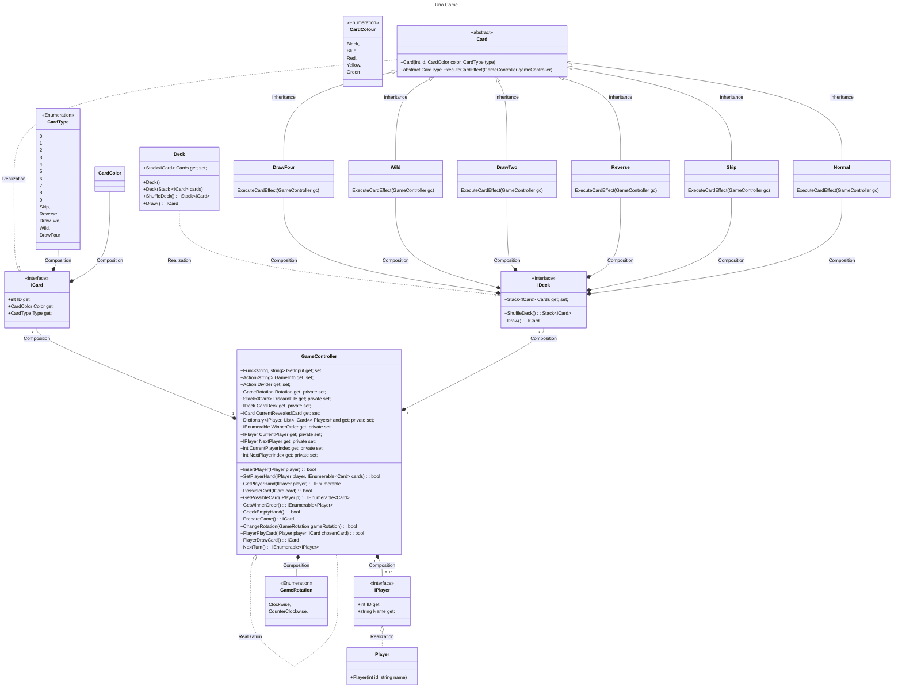

```mermaid
---
title: Uno Game
---

classDiagram
    class CardColour{
        <<Enumeration>>
        Black,
        Blue,
        Red,
        Yellow,
        Green
    }

    class CardType{
        <<Enumeration>>
        0,
        1,
        2,
        3,
        4,
        5,
        6,
        7,
        8,
        9,
        Skip,
        Reverse,
        DrawTwo,
        Wild,
        DrawFour
    }

    class ICard{
        <<Interface>>
        +int ID get;
        +CardColor Color get;
        +CardType Type get;
    }


    class Card{
        <<abstract>>
        +Card(int id, CardColor color, CardType type)
        +abstract CardType ExecuteCardEffect(GameController gameController)
    }

    Card ..|> ICard : Realization
    Deck ..|> IDeck : Realization
    IPlayer <|.. Player : Realization
    GameController <|.. GameController : Realization

    CardType --* ICard : Composition
    CardColor  --* ICard : Composition
    
    Card <|-- DrawFour : Inheritance
    Card <|-- Wild : Inheritance
    Card <|-- DrawTwo : Inheritance
    Card <|-- Reverse : Inheritance
    Card <|-- Skip : Inheritance
    Card <|-- Normal : Inheritance

    DrawFour --* IDeck : Composition
    Wild --* IDeck : Composition
    DrawTwo --* IDeck : Composition
    Reverse --* IDeck : Composition
    Skip --* IDeck : Composition
    Normal --* IDeck : Composition

    ICard "*" --* "1" GameController : Composition
    IDeck "*" --* "1" GameController : Composition
    GameController "1" *-- "2..10" IPlayer : Composition
    GameController *-- GameRotation  : Composition
    
    class IPlayer{
        <<Interface>>
        +int ID get;
        +string Name get;
    }

    class Player{       
        +Player(int id, string name)
    }

    class DrawFour{
        ExecuteCardEffect(GameController gc)
    }

    class Wild{
        ExecuteCardEffect(GameController gc)
    }

    class DrawTwo{
        ExecuteCardEffect(GameController gc)
    }

    class Reverse{
        ExecuteCardEffect(GameController gc)
    }

    class Skip{
        ExecuteCardEffect(GameController gc)
    }

    class Normal{
        ExecuteCardEffect(GameController gc)
    }

    class IDeck{
        <<Interface>>
        +Stack~ICard~ Cards get; set;
        +ShuffleDeck() : Stack~ICard~
        +Draw() : ICard
    }

    class Deck{
        +Stack~ICard~ Cards get; set;
        +Deck()
        +Deck(Stack ~ICard~ cards)
        +ShuffleDeck() : Stack~ICard~
        +Draw() : ICard
    }
    
    class GameRotation{
        <<Enumeration>>
        Clockwise,
        CounterClockwise,
    }

    class GameController{
        +Func~string, string~ GetInput get; set;
        +Action~string~ GameInfo get; set;
        +Action Divider get; set;
        +GameRotation Rotation get; private set;
        +Stack~ICard~ DiscardPile get; private set; 
        +IDeck CardDeck get; private set;
        +ICard CurrentRevealedCard get; set; 
        +Dictionary~IPlayer, List<.ICard>~ PlayersHand get; private set; 
        +IEnumerable<IPlayer> WinnerOrder get; private set; 
        +IPlayer CurrentPlayer get; private set; 
        +IPlayer NextPlayer get; private set; 
        +int CurrentPlayerIndex get; private set; 
        +int NextPlayerIndex get; private set; 
        
        +InsertPlayer(IPlayer player) : bool
        +SetPlayerHand(IPlayer player, IEnumerable~Card~ cards) : bool
        +GetPlayerHand(IPlayer player) : IEnumerable<ICard>
        +PossibleCard(ICard card) : bool
        +GetPossibleCard(IPlayer p) : IEnumerable~Card~
        +GetWinnerOrder() : IEnumerable~Player~
        +CheckEmptyHand() : bool

        %% Player Action
        +PrepareGame() : ICard
        +ChangeRotation(GameRotation gameRotation) : bool
        +PlayerPlayCard(IPlayer player, ICard chosenCard) : bool
  
        %% Game System & Player Action
        +PlayerDrawCard() : ICard
        +NextTurn() : IEnumerable~IPlayer~
    }


```

