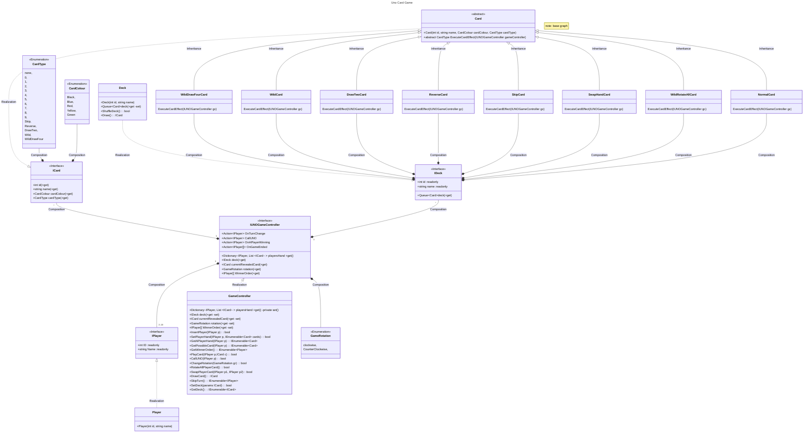

```mermaid
---
title: Uno Card Game
---
classDiagram
    %% https://service.mattel.com/instruction_sheets/42003-Wild.pdf
    note "note: base graph"
    class CardColour{
        <<Enumeration>>
        Black,
        Blue,
        Red,
        Yellow,
        Green
    }

    class CardType{
        <<Enumeration>>
        none,
        0,
        1,
        2,
        3,
        4,
        5,
        6,
        7,
        8,
        9,
        Skip,
        Reverse,
        DrawTwo,
        Wild,
        WildDrawFour
    }

    class ICard{
        <<Interface>>
        +int id (+get)
        +string name (+get)
        +CardColour cardColour (+get)
        +CardType cardType (+get)
    }

    class Card{
        <<abstract>>
        +Card(int id, string name, CardColour cardColour, CardType cardType)
        +abstract CardType ExecuteCardEffect(IUNOGameController gameController)
    }

    Card ..|> ICard : Realization
    Deck ..|> IDeck : Realization
    IPlayer <|.. Player : Realization
    IUNOGameController <|.. GameController : Realization

    CardType --* ICard : Composition
    CardColour  --* ICard : Composition
    
    

    Card <|-- WildDrawFourCard : Inheritance
    Card <|-- WildCard : Inheritance
    Card <|-- DrawTwoCard : Inheritance
    Card <|-- ReverseCard : Inheritance
    Card <|-- SkipCard : Inheritance
    Card <|-- SwapHandCard : Inheritance
    Card <|-- WildRotateAllCard : Inheritance
    Card <|-- NormalCard : Inheritance

    WildDrawFourCard --* IDeck : Composition
    WildCard --* IDeck : Composition
    DrawTwoCard --* IDeck : Composition
    ReverseCard --* IDeck : Composition
    SkipCard --* IDeck : Composition
    SwapHandCard --* IDeck : Composition
    WildRotateAllCard  --* IDeck : Composition
    NormalCard --* IDeck : Composition


    ICard "*" --* "1" IUNOGameController : Composition
    IDeck "*" --* "1" IUNOGameController : Composition
    IUNOGameController "1" *-- "2..10" IPlayer : Composition
    IUNOGameController *-- GameRotation  : Composition
    
    class IPlayer{
        <<Interface>>
        +int ID :readonly
        +string Name :readonly
    }

    class Player{       
        +Player(int id, string name)
    }

    

    class WildDrawFourCard{
        ExecuteCardEffect(IUNOGameController gc)
    }

    class WildCard{
        ExecuteCardEffect(IUNOGameController gc)
    }

    class DrawTwoCard{
        ExecuteCardEffect(IUNOGameController gc)
    }

    class ReverseCard{
        ExecuteCardEffect(IUNOGameController gc)
    }

    class SkipCard{
        ExecuteCardEffect(IUNOGameController gc)
    }

    class SwapHandCard{
        ExecuteCardEffect(IUNOGameController gc)
    }

    class WildRotateAllCard{
        %% WildCustomizableCard
        ExecuteCardEffect(IUNOGameController gc)
    }
    class NormalCard{
        ExecuteCardEffect(IUNOGameController gc)
    }

    
    class IDeck{
        <<Interface>>
        +int id :readonly
        +string name :readonly
        +Queue~Card~deck (+get)
    }

    class Deck{
        +Deck(int id, string name)
        +Queue~Card~deck (+get -set)
        +ShuffleDeck() : bool
        +Draw() : ICard
    }
    
    class GameRotation{
        <<Enumeration>>
        clockwise,
        CounterClockwise,
    }

    class IUNOGameController{
        <<Interface>>
        +Dictionary~IPlayer, List ~ICard~ ~ playersHand +get()
        +IDeck deck (+get)
        
        +ICard currentRevealedCard (+get)

        +GameRotation rotation (+get)
        +IPlayer[] WinnerOrder (+get)

        +Action~IPlayer~ OnTurnChange
        +Action~IPlayer~ CallUNO
        +Action~IPlayer~ OnAPlayerWinning
        +Action~IPlayer[]~ OnGameEnded

        
    }

    class GameController{
        
        
        %% Game System 
        +Dictionary~IPlayer, List ~ICard~ ~ playersHand +get() -private set()
        +IDeck deck (+get -set)
        
        +ICard currentRevealedCard (+get -set)

        +GameRotation rotation (+get -set)
        +IPlayer[] WinnerOrder (+get -set)
        
        
        
        %% Game Manager
        +InsertPlayer(IPlayer p) : bool
        %%Card[] cards
        +SetPlayerHand(IPlayer p, IEnumerable~Card~ cards) : bool
        %%List<Card> 
        +GetAPlayerHand(IPlayer p) : IEnumerable~Card~
        %%List<Card> 
        +GetPossibleCard(IPlayer p) : IEnumerable~Card~
        %%Player[]
        +GetWinnerOrder() : IEnumerable~Player~

        %% Player Action
        +PlayCard(IPlayer p,ICard c) : bool
        +CallUNO(IPlayer p) : bool
        +ChangeRotation(GameRotation gr) : bool
        +RotateAllPlayerCard() : bool
        +SwapPlayerCard(IPlayer p1, IPlayer p2) :bool
        
        %% Game System & Player Action
        +DrawCard() : ICard
        +SkipTurn() : IEnumerable~IPlayer~

        +SetDeck(params ICard) : bool
        +GetDeck() : IEnumerable~ICard~
    }

```

